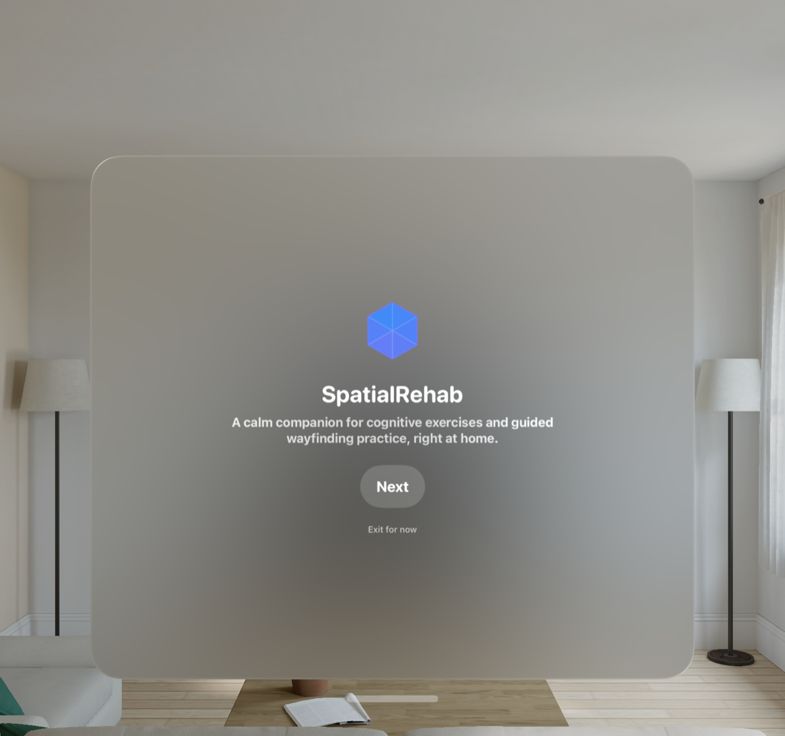
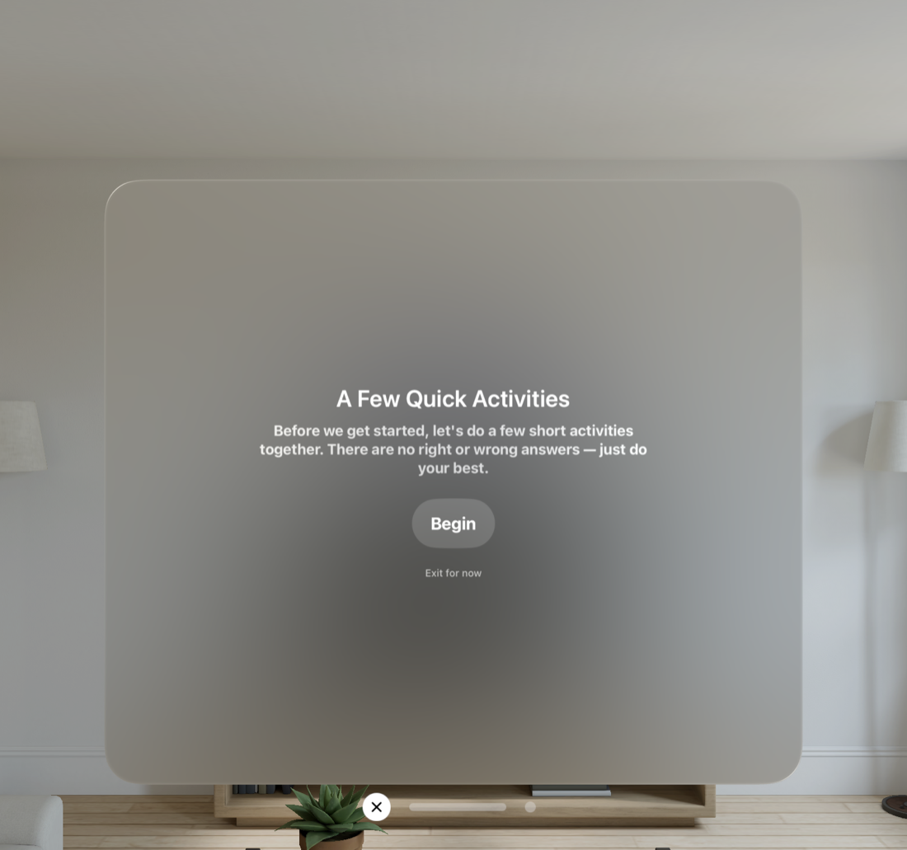
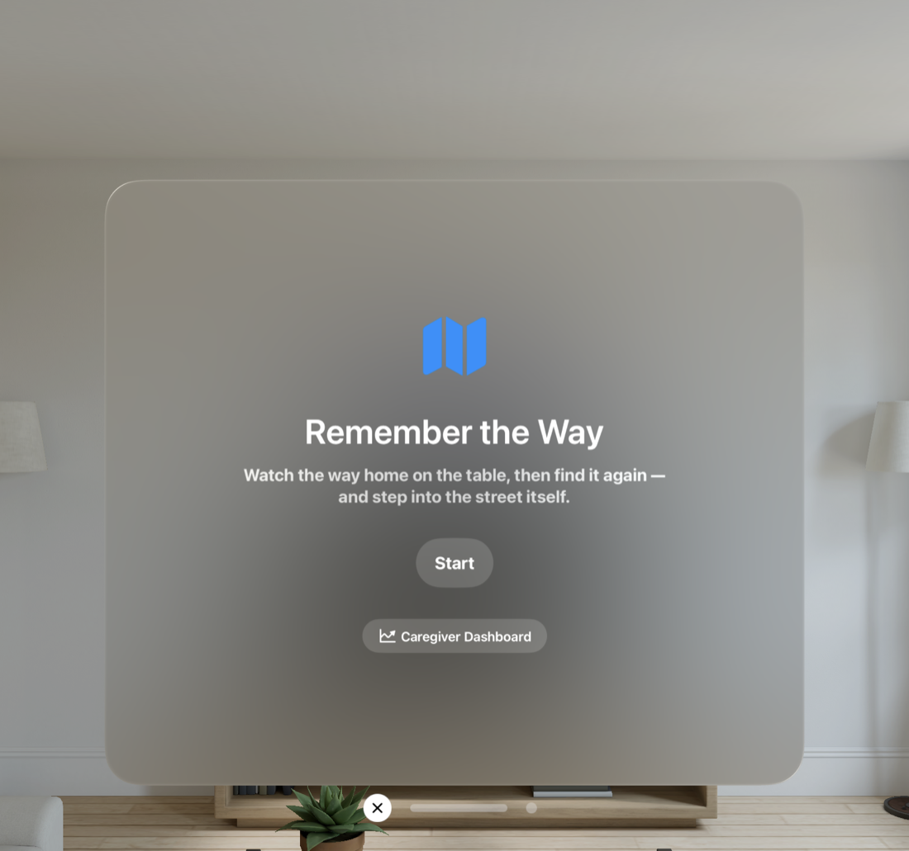
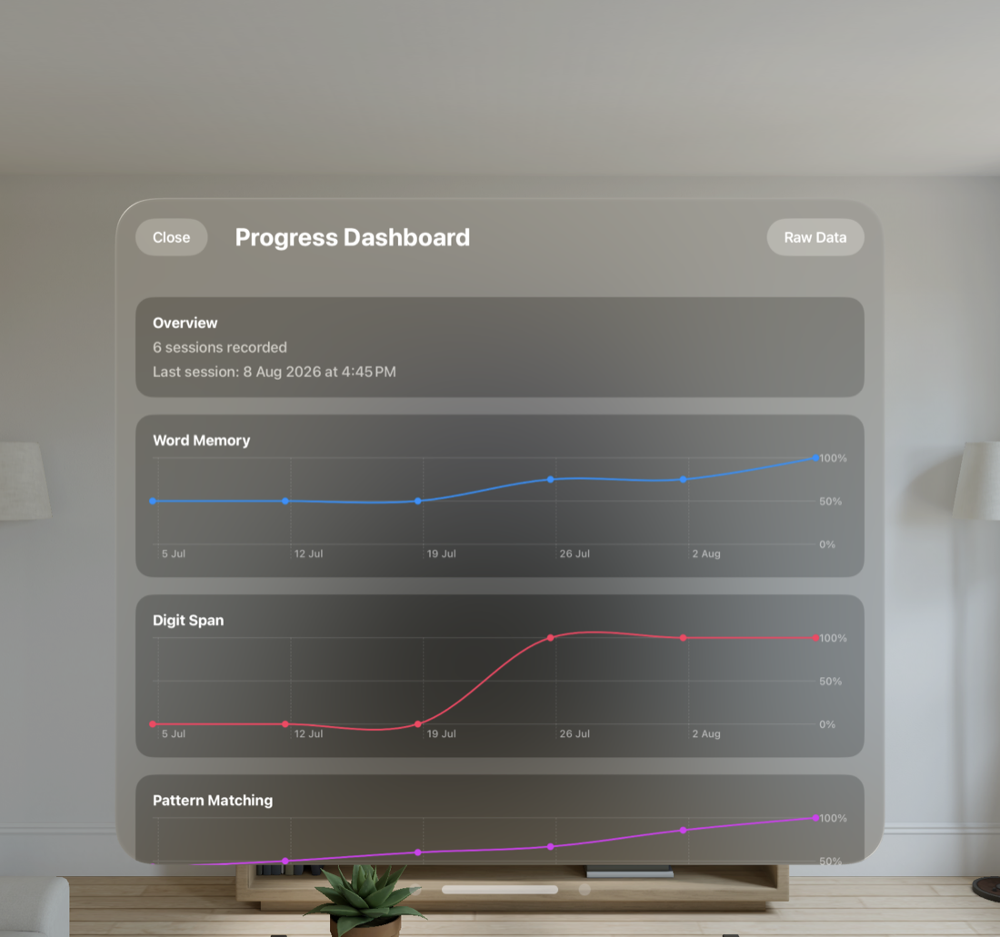

<div align="center">


# SpatialRehab

**Errorless-learning cognitive rehab for early-stage dementia, built for Apple Vision Pro.**

A calm, spatial companion that runs a short cognitive baseline the first time someone puts
the headset on, then turns that baseline into a wayfinding exercise a person can practice —
and a caregiver can actually watch improve.

[](https://developer.apple.com/visionos/)
[](https://developer.apple.com/xcode/swiftui/)
[](https://developer.apple.com/documentation/realitykit)
[](https://developer.apple.com/documentation/charts)

</div>

---

## The idea in 30 seconds

Early-stage dementia care leans on two things: **routine** and **errorless learning** —
never letting someone feel they got something wrong, because the anxiety from failure
undoes more than the correction teaches. SpatialRehab puts both principles into a visionOS
app:

1. **On first launch**, the person runs an 8-game cognitive baseline — reaction time,
   orientation, word memory, digit span, pattern matching, trail making, arithmetic, and a
   clock-drawing test — each one silently scored, none of it ever shown to the patient as a
   score, grade, or "wrong" indicator.
2. **Day to day**, they practice **Remember the Way**: a miniature 3D neighborhood rises out
   of a holographic tabletop, they study the route home, trace it back from memory, then
   step *inside* the model at life size and walk the actual route in a calm, seated,
   passthrough-blended world.
3. **In the background**, a caregiver dashboard turns every session into a trend line —
   because "is this getting better or worse" is a question a family member should be able
   to answer in ten seconds, not by guessing.

Nothing here diagnoses anything. It's a rehearsal space — for a mind and for the route home.

## Why errorless learning, specifically

People with dementia retain **procedural and implicit memory** — the "how" — far longer
than they retain the explicit memory of *whether they got it right*. Corrective feedback
("no, try again") relies on the explicit memory that's failing first, so it teaches the
error along with the anxiety of having made it, and very little else. Errorless learning
sidesteps that entirely: never present a wrong answer as an option to dwell on, never signal
failure, let repetition and gentle recognition do the work instead.

Every design choice in this codebase traces back to that one rule:

- No score, percentage, checkmark, or red/green ever reaches the patient's screen.
- Mismatches (a pattern-matching miss, an out-of-order trail tap) just quietly reset — no
  "incorrect" banner, no buzzer, no penalty.
- Retrying is free: the clock-drawing canvas has an unconditional **Clear**, and wayfinding
  recall never blocks on a wrong turn.
- Locomotion in the immersive world is seated, constant-velocity, and blink-cut on sharp
  turns — no smooth rotation, no acceleration, nothing that risks vestibular disorientation.

## See it

<table>
<tr>
<td width="50%"></td>
<td width="50%"></td>
</tr>
<tr>
<td align="center"><sub>First launch — brand, then activities, one screen at a time</sub></td>
<td align="center"><sub>No right or wrong answers, stated up front</sub></td>
</tr>
<tr>
<td width="50%"></td>
<td width="50%"></td>
</tr>
<tr>
<td align="center"><sub>The daily exercise, reached once the baseline is done</sub></td>
<td align="center"><sub>Every session becomes a trend line, never a grade</sub></td>
</tr>
</table>

## How it works

###  The baseline battery

Eight short games (`SpatialRehab/Views/*GameView.swift`, one file per game) run back to back
behind `BaselineAssessmentSession` — an `@Observable` linear phase machine with no way to go
back and no in-flow "skip," so a run only ever represents forward progress. Related domains
sit next to each other in the order (memory games together, executive-function games
together), and it opens on the lowest-friction game — a literal reaction-time tap — as a
warm-up. Every game computes its own `score` (or deliberately doesn't: clock-drawing stays
unscored, reaction time reports raw milliseconds instead of forcing a percentage), but that
number never renders anywhere the patient can see it. See
[`Docs/BaselineAssessment_Design.md`](Docs/BaselineAssessment_Design.md) for the full
per-game rationale.

###  Remember the Way

The flagship exercise, and the most visually ambitious part of the app. A real
OpenStreetMap extract of a Tiong Bahru neighborhood is procedurally meshed at runtime
(`NeighborhoodWorld.swift`) — extruded, textured shophouse buildings, road ribbons, street
lamps, trees — and mounted as a miniature on a holographic tabletop
(`RouteMemoryTableView.swift`) that lives in a shared `ImmersiveSpace`. The exercise runs in
three phases: **study** (the route animates itself along the table, repeating for
encoding), **recall** (the map locks, the person traces the route from memory, scored by
distance from the real polyline — never shown as pass/fail), and **step inside**, where the
whole miniature scales up to life size around the person and they walk the actual route
with a single seated pinch-and-hold gesture — constant velocity, blink-cut turns, spoken
guidance throughout (`VoiceGuide.swift`, `AVSpeechSynthesizer`). A glowing pin marks home
from anywhere in the world.

###  Caregiver dashboard

`BaselineResultsStore` persists every game's result as an **appended history array**, not a
single overwritten value — the entire premise of a "baseline" falls apart if only the most
recent session survives. `CaregiverDashboardView` turns that history into Swift Charts trend
lines (one per scoreable game, each with a stable identity color) plus a horizontally
scrolling gallery of clock-drawing sketches over time. A "Raw Data" toolbar button opens the
dev-only `BaselineResultsDebugView` for verifying exactly what got captured, underneath the
polished view.

###  Recommendation engine

`GameRecommendationEngine` ranks three cognitive domains (memory, numeracy, executive
function) by weakness — `priority = 1 - score` — from the baseline's scored games, and maps
the weakest domain to a catalog of suggested follow-up exercises
(`StimulationGame.swift`). It's a plain weighted comparison, not a trained model: a single
patient never generates enough sessions to fit anything meaningful. Currently wired into the
dev debug view only — the suggested games don't have real screens built yet, so recommending
one to a person with dementia would point at something not tappable. Promoting this to the
patient-facing summary is the next step once those exist.

| Surface | Where | What it is |
|---|---|---|
| Baseline battery | `SpatialRehab/Views/*GameView.swift`, `Models/BaselineAssessment*.swift` | 8-game first-run cognitive assessment, silently scored |
| Remember the Way | `RouteMemoryView.swift`, `RouteMemoryExercise.swift`, `NeighborhoodWorld.swift` | Study → recall → step-inside wayfinding exercise |
| Caregiver dashboard | `Views/CaregiverDashboardView.swift`, `Views/ScoreTrendChart.swift` | Per-game trend charts + clock-drawing gallery |
| Recommendation engine | `Models/GameRecommendationEngine.swift`, `CognitiveDomain.swift` | Ranks weakest cognitive domain from baseline scores |
| Results storage | `Models/BaselineResultsStore.swift` | `UserDefaults`-backed, per-game history arrays |

## Try it yourself

Requires **Xcode Beta with the visionOS SDK** (visionOS isn't in stable Xcode yet) and the
visionOS Simulator — there's no physical-device-only code path, everything here runs and was
verified in Simulator.

```bash
# Install XcodeGen once, if you don't have it
brew install xcodegen

# Generate the .xcodeproj from project.yml
xcodegen generate

# Open and run
open SpatialRehab.xcodeproj
```

Then build and run onto an Apple Vision Pro Simulator target. No SPM dependencies, no API
keys, no backend — everything is on-device, `UserDefaults`-backed, and works fully offline.

Regenerate the project (`xcodegen generate`) any time you add or remove a source file —
`project.yml` is the source of truth for the Xcode project, not the `.xcodeproj` itself.

## Team

Built for a hackathon by a five-person team, each owning a distinct slice:

| Person | Focus | Deliverables |
|---|---|---|
| Aditya | 3D Assets & Environment | Interactive 3D models and scenes |
| Brian | UX/UI & Spatial Design | Onboarding, guidance, interaction flow |
| JingTong | Apple Vision Pro Development | RealityKit scene setup, hand/gaze input |
| Nicole | Clinical Research & Content | Evidence-based exercise design and validation |
| Basil | AI, Analytics & Integration | Baseline metrics, recommendation engine, caregiver dashboard |

## Where we're taking this

- **Clinical review** — the baseline's word list, distractor strategy, study durations, and
  question content are all placeholders pending Nicole's review; none of it has been
  validated against real assessment instruments yet.
- **A "My People" reminiscence module** already exists in the codebase
  (`Views/MyPeopleView.swift`) — photo cards of familiar people with a short note each — but
  isn't wired into navigation yet.
- **Promoting the recommendation engine** from the dev debug view to an actual
  patient-facing "what to practice next" flow, once its suggested games exist as real
  screens.
- **Adaptive difficulty**, in progress on a teammate's branch, to tune each exercise to the
  person playing it rather than a fixed difficulty for everyone.
- Full history lives in [`CHANGELOG.md`](CHANGELOG.md) — every change in this repo is
  recorded there as it happens, including the false starts.

## Disclaimer

This is a hackathon prototype, not a medical device. It has not been clinically validated,
makes no diagnostic claims, and should not be used as a substitute for professional
dementia care or assessment. The baseline battery borrows structure from established
cognitive-assessment concepts (clock-drawing, digit span, orientation) but its specific
content has not been reviewed by a clinician.

---

<div align="center">


**SpatialRehab** — practice makes the route feel like home again.

</div>
